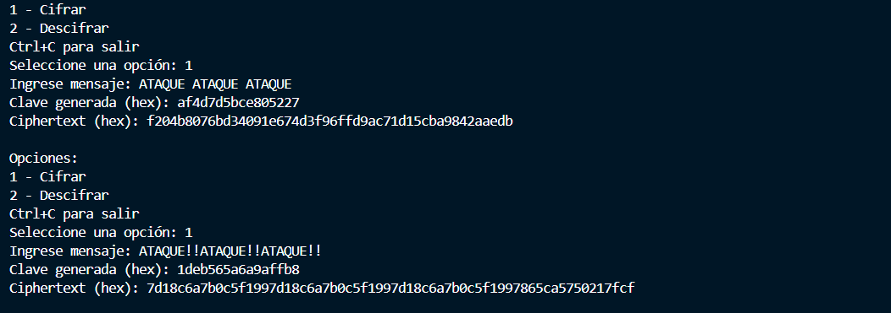
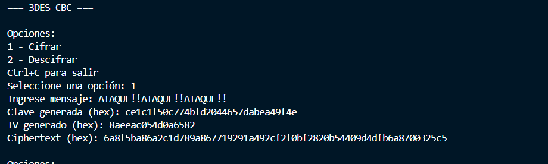
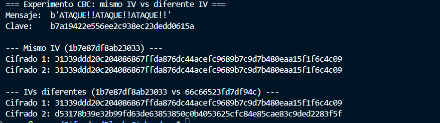
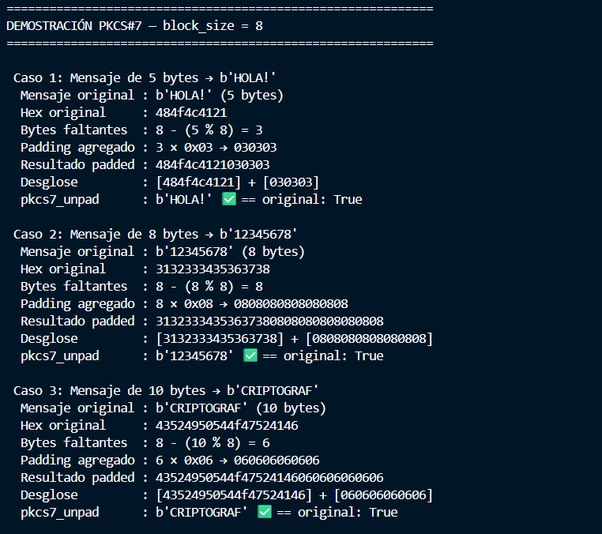

# Laboratorio 2: block cipher

Repositorio:


1. ¿Qué tamaño de clave está usando para DES, 3DES y AES?

- Para DES se usa una llave de 8 bytes (64 bits). Solamente 56 de estos bits se usan pues hay 8 que son de paridad (osea, que sirven para determinar si no hay errores en la transmisión del mensaje). Para generarla usamos la función token_bytes de la librería secrets y le indicamos que queremos generar 8 bytes aleatorios

```python
def generate_des_key():
    """
    Genera una clave DES aleatoria de 8 bytes (64 bits).
    Nota: DES usa efectivamente 56 bits (los otros 8 son de paridad),
    pero la clave es de 8 bytes.
    """
    return secrets.token_bytes(8)
```

- En 3DES la llave es de 64 bits (8 bytes) pero aqui se usan 3 o 2 llaves dependiendo del modo en el que queramos cifrar el mensaje. La librería crytodome tiene un método para cifrar en descifrar en DES y solo necesita que le pasemos 24 o 16 bytes random (24 bytes si quereos usar 3 llaves y 16 si queremos 2).

```python
def generate_3des_key(key_option: int = 2):
    """
    Genera una clave 3DES aleatoria.
    """
    if key_option == 2:
        return secrets.token_bytes(16)
    elif key_option == 3:
        return secrets.token_bytes(24)
    else:
        raise ValueError("key_option debe ser 2 o 3")
```

- En AES la llave puede ser de 256, 192 o 128 bits. Para generarla usamos secrets y convertimos el tamaño de la llave en bits a bytes.

```python
def generate_aes_key(key_size: int = 256):
    """
    Genera una clave AES aleatoria.
    """
    # TODO: Implementar
    if key_size not in (128, 192, 256):
        raise ValueError("AES solo permite 128, 192 o 256 bits")
    
    return secrets.token_bytes(key_size // 8)
```

DES se considera inseguro porque la llave está en el espacio $2^56$ y para las computadoras actuales es muy fácil hacr ataques de fuerza bruta en ese espacio de búsqueda. En los 90's lograron romperlo en 9 días, con hardware actual es probable que DES sea roto en minutos u horas pues existe la tecnología para hacer operaciones de forma paralela y los GPU son bastante rápidos para hacer muchas operaciones en poco tiempo. 

2. Comparación ECB vs CBC 

- ¿Qué modo de operación implementó en cada algoritmo?

Para DES se usó el modo ECB, para 3DES CBC y para AES los 2. 

- ¿Cuáles son las diferencias fundamentales entre ECB y CBC?

ECB aplica el algoritmo de cifrado (DES, AES o 3DES) a cada bloque mientras que CBC primero hace un XOR entre un vector aleatorio y el mensaje original, luego aplicar el algoritmo de cifrado sobre el resultado de esa operación y luego usa el output de cada bloque para xorearlo con el mensaje original del siguiente bloque. 

Ahora vamos a ver como se comprotan los distintos modos del cifrado AES con imágenes:

- Original


- EBC


- CBC


Podemos ver que con ebc se pueden idetificar los patrones de la imagen original pero en cbc toda la imagen parece ruido, esto se debe a que en la imagen original hay muchos bloques parecidos y producen el mismo output si no hacemos una transformación adicional como se hace en el algoritmo cbc. 

- Original


- EBC


- CBC


Aquí vemos que son bastante parecidas con ambos algoritmos, posiblemente a pesar de verse similares, los pixeles de la imagen no tienen exactamente los mismos valores y por eso se ven diferentes aunque si podemos notar ligeras similitudes en ciertas regiones de la imagen (hay áreas que parecen seguir un patrón).

- Original


- EBC


- CBC


Finalmente, con la última imagen vemos que son muy similares, posiblemente la imagen original usa colores similares pero distintos y por eso en EBC parece que no hay ningún patrón en la imagen

El código utilizado se puede ver en 


3. ¿Por qué no debemos usar ECB en datos sensibles?

No deberíamos usar ECB con datos sensibles pues si hay datos que son iguales o tienen muchas smilitudes, van a dar un output parecido y un atacante podría identificar esos patrones y descifrar nuestro algoritmo de cifrado. 

Vamos a ver uin ejemplo, si en DEs con EBC usamos el mensage ATAQUE!!ATAQUE!!ATAQUE!! lo va a dividir en bloques iguales



Vemos que se genera la cadena: 7d18c6a7b0c5f1997d18c6a7b0c5f1997d18c6a7b0c5f1997865ca5750217fcf

Y esta tiene estos patreones en similar:

7d18c6a7b0c5f199 | 7d18c6a7b0c5f199 | 7d18c6a7b0c5f199 | 7865ca5750217fcf
   Bloque 1      |    Bloque 2      |    Bloque 3      |    Padding
   "ATAQUE!!"    |   "ATAQUE!!"     |   "ATAQUE!!"     |

Los 3 bloques se cifran exactamente igual, en un escenario real un atacante podría identificar que un mismo bloque produce una misma salida y en base a eso probar diferentes llaves y algoritmos para encontrar el correcto y luego extraer nuestra información.

Si probamos el mismo mensaje pero con CBC




Vemos que la cadena 6a8f5ba86a2c1d789a867719291a492cf2f0bf2820b54409d4dfb6a8700325c5 ya no muetra patrones identificables y por lo tanto es más difícil de descifrar.

4.  ¿Qué es el IV y por qué es necesario en CBC pero no en ECB?

Es un vector de bytes aleatorio, es necesario en CBC porque nos ayuda a hacer la primera transformación sobre el mensaje original. En ECB no se usa pues no necesitamos hacer transformaciones, solamente aplicar el algoritmo. 



Si usamos el mismo IV para el mismo mensaje vemos que producimos una misma salida mientras que si usamos uno diferente se produce un cifrado diferente. Un atacante podría identificar el IV con el que estamos cifrando si siempre usamos el mismo y lograr hacer el proceso inverso y obtener nuestra información.

5. ¿Qué es el padding y por qué es necesario?

El padding son caracteres que usamos para rellenar si un mensaje no puede dividirse de forma correcta en bloques exactos.



6. ¿En qué situaciones se recomienda cada modo de operación? ¿Cómo elegir un modo seguro en cada lenguaje de programación?


## Tabla Comparativa

| Característica       | ECB                        | CBC                         | CTR                          | GCM                          |
|----------------------|----------------------------|-----------------------------|------------------------------|------------------------------|
| **Padding**          | Sí                         | Sí                          | No                           | No                           |
| **IV / Nonce**       | No                         | Sí (IV 16 bytes)            | Sí (nonce)                   | Sí (nonce 12 bytes)          |
| **Autenticación**    | No                         | No                          | No                           | Sí (AEAD)                    |
| **Paralelizable**    | Sí                         | Solo descifrado             | Sí                           | Sí                           |
| **Acceso aleatorio** | Sí                         | No                          | Sí                           | Sí                           |
| **Seguridad**        |  Inseguro                | Aceptable               |  Bueno                     | Recomendado             |

---

## ECB — Electronic Codebook

### Cómo funciona
Divide el mensaje en bloques y cifra cada uno de forma independiente con la misma clave.

### Casos de uso recomendados
- Ninguno en producción. Únicamente útil con fines educativos o para cifrar un único bloque aislado (ej. cifrar una clave con otra clave).

### Desventajas
- Bloques de plaintext idénticos producen bloques de ciphertext idénticos.
- Revela patrones en el mensaje original (demostrable visualmente con imágenes).
- Vulnerable a ataques de replay y sustitución de bloques.

---

## CBC — Cipher Block Chaining

### Cómo funciona
Cada bloque se XORea con el bloque cifrado anterior antes de cifrarse. El primer bloque usa un IV aleatorio.

### Casos de uso recomendados
- Cifrado de archivos en reposo cuando no se requiere autenticación separada.
- Sistemas legacy que aún no migran a modos AEAD.
- TLS 1.2 (aunque ya está siendo reemplazado por GCM).

### Desventajas
- Requiere padding → vulnerable a padding oracle attacks (ej. POODLE, BEAST).
- No provee autenticación: un atacante puede modificar el ciphertext sin detección.
- El cifrado no es paralelizable (cada bloque depende del anterior).
- Reutilizar el IV con la misma clave rompe la seguridad.

---

## CTR — Counter Mode

### Cómo funciona
Convierte el cifrado de bloque en un cifrado de flujo. Cifra un contador incremental y XORea el resultado con el plaintext. No requiere padding.

### Casos de uso recomendados
- Cifrado de streams o datos de longitud variable.
- Sistemas donde se necesita acceso aleatorio a partes del ciphertext.
- Aplicaciones de alto rendimiento (totalmente paralelizable).

### Desventajas
- No provee autenticación: igual que CBC, no detecta manipulaciones.
- Reutilizar nonce+clave es catastrófico: permite recuperar el plaintext mediante XOR.
- Requiere gestión cuidadosa del contador para evitar repeticiones.

---

## GCM — Galois/Counter Mode

### Cómo funciona
Combina CTR para el cifrado con GHASH para la autenticación. Produce un ciphertext y un tag de autenticación (MAC) en una sola operación. Es un modo AEAD (Authenticated Encryption with Associated Data).

### ¿Qué es AEAD?
AEAD garantiza simultáneamente:
- Confidencialidad: el contenido está cifrado.
- Integridad: cualquier modificación del ciphertext es detectable.
- Autenticidad: el mensaje proviene de quien tiene la clave.

Además permite incluir datos asociados (ej. cabeceras, metadatos) que se autentican pero no se cifran, lo cual es útil para proteger headers de red.

### Casos de uso recomendados
- Caso de uso por defecto para cualquier cifrado simétrico moderno.
- TLS 1.3 (AES-128-GCM y AES-256-GCM son los cipher suites principales).
- Cifrado de bases de datos, archivos, tokens de sesión.
- APIs que necesitan garantizar que los datos no fueron alterados en tránsito.

### Desventajas
- Reutilizar el nonce con la misma clave rompe tanto la confidencialidad como la autenticación.
- Implementaciones incorrectas del tag de autenticación pueden anular la seguridad.
- Ligeramente más complejo de implementar correctamente que CBC.

---

## Ejemplos de código: AES-GCM

### Python — `cryptography`

```python
from cryptography.hazmat.primitives.ciphers.aead import AESGCM
import os

# Cifrar
key = AESGCM.generate_key(bit_length=256)
aesgcm = AESGCM(key)
nonce = os.urandom(12)          # 96 bits, nunca reutilizar
plaintext = b"Mensaje secreto"
aad = b"header-no-cifrado"      # datos asociados (opcional)

ciphertext = aesgcm.encrypt(nonce, plaintext, aad)
print(f"Ciphertext: {ciphertext.hex()}")

# Descifrar (lanza excepción si el tag falla)
recovered = aesgcm.decrypt(nonce, ciphertext, aad)
print(f"Recovered: {recovered}")
```

### Java — `javax.crypto`

```java
import javax.crypto.Cipher;
import javax.crypto.KeyGenerator;
import javax.crypto.SecretKey;
import javax.crypto.spec.GCMParameterSpec;
import java.security.SecureRandom;

public class AesGcmExample {

    private static final int GCM_TAG_LENGTH = 128; // bits

    public static byte[] encrypt(byte[] plaintext, SecretKey key) throws Exception {
        byte[] nonce = new byte[12];
        new SecureRandom().nextBytes(nonce);

        Cipher cipher = Cipher.getInstance("AES/GCM/NoPadding");
        GCMParameterSpec spec = new GCMParameterSpec(GCM_TAG_LENGTH, nonce);
        cipher.init(Cipher.ENCRYPT_MODE, key, spec);

        byte[] ciphertext = cipher.doFinal(plaintext);

        // Concatenar nonce + ciphertext para transmisión
        byte[] result = new byte[nonce.length + ciphertext.length];
        System.arraycopy(nonce, 0, result, 0, nonce.length);
        System.arraycopy(ciphertext, 0, result, nonce.length, ciphertext.length);
        return result;
    }

    public static byte[] decrypt(byte[] nonceAndCiphertext, SecretKey key) throws Exception {
        byte[] nonce = new byte[12];
        byte[] ciphertext = new byte[nonceAndCiphertext.length - 12];

        System.arraycopy(nonceAndCiphertext, 0, nonce, 0, 12);
        System.arraycopy(nonceAndCiphertext, 12, ciphertext, 0, ciphertext.length);

        Cipher cipher = Cipher.getInstance("AES/GCM/NoPadding");
        GCMParameterSpec spec = new GCMParameterSpec(GCM_TAG_LENGTH, nonce);
        cipher.init(Cipher.DECRYPT_MODE, key, spec);

        return cipher.doFinal(ciphertext); // lanza AEADBadTagException si el tag falla
    }

    public static void main(String[] args) throws Exception {
        KeyGenerator kg = KeyGenerator.getInstance("AES");
        kg.init(256);
        SecretKey key = kg.generateKey();

        byte[] encrypted = encrypt("Mensaje secreto".getBytes(), key);
        byte[] decrypted = decrypt(encrypted, key);
        System.out.println("Recovered: " + new String(decrypted));
    }
}
```
